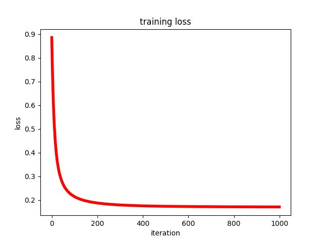
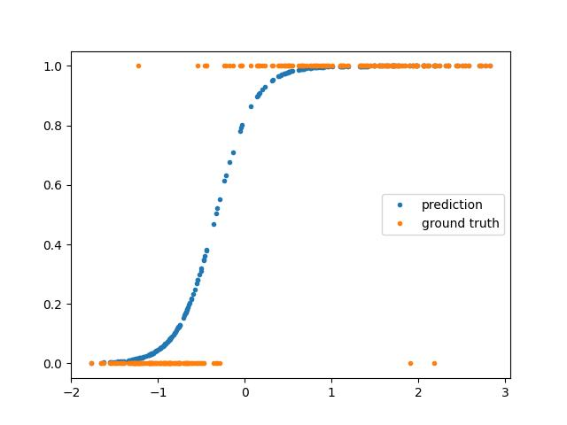
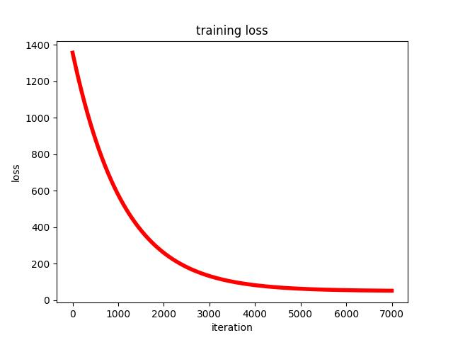
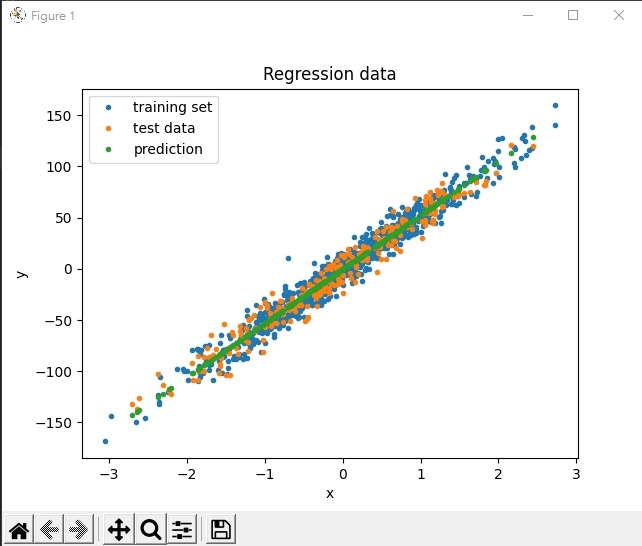

# ML_intro

* You could download the notebooks & data then `run all` on your local environment or GoogleColab
* You might need to download some package if you don't have some of them.

## HW1: Logistic regression and Linear Regression using Gradient Descent

### Goals
In this coding assignment, you need to implement linear regression by using only NumPy, then train your implemented model using Gradient Descent by the provided dataset and test the performance with testing data.

Find the questions at [here](https://docs.google.com/document/d/1kBR0tqYltq1YEoFiwem0Yzn_MYq5wNyzJG9LeURHDYE/edit?usp=sharing)

### Output

* LinearRegression
MSE is 54.2685
Intercept is [-0.4061] and weights are [50.7277]
* LogisticRegression
Cross Entropy Error is 0.1854
Intercept is [4.5803] and weights are [1.5370]

| Method            | Learning Curve | Result |
| ----------------- | -------- | -------- |
| Logistic Regression |  |          |
| Linear Regression |      |      |

## HW2: Linear Discriminant Analysis

### Goals
In hw2, you need to implement Fisher’s linear discriminant by using only numpy, then train your implemented model by the provided dataset and test the performance with testing data

Please note that only NUMPY can be used to implement your model, you will get no points by simply calling sklearn.discriminant_analysis.LinearDiscriminantAnalysis

Find the questions at https://docs.google.com/document/d/1T7JLWuDtzOgEQ_OPSgsSiQdp5pd-nS5bKTdU3RR48Z4/edit?usp=sharing

### Result

| Attributes            | Class 1 | Class 2|
| ----------------- | -------- | ------- |
| mean vectors |  | |
| within-class matrix |      | |
| between-class matrix |      | |
| Fisher's Linear Discriminant |      | |

* Projection Result 

## HW3: Decision Tree, AdaBoost and Random Forest

### Goals
In this coding assignment, you need to implement the Decision Tree, AdaBoost and Random Forest algorithm by using only NumPy, then train your implemented model by the provided dataset and test the performance with testing data. Find the sample code and data on the GitHub page.

Please note that only NumPy can be used to implement your model, you will get no points by simply calling sklearn.tree.DecsionTreeClassifier.

Find the questions at this [document](https://docs.google.com/document/d/1ODV5FtIIn6fXjExL6cF8UOsQ-ctu53jObOAjrcSmqfw/edit?usp=sharing)

### Result

## HW4: Decision Tree, AdaBoost and Random Forest

### Goals
In this coding assignment, you need to implement the Cross-validation and grid search by using only NumPy, then train the SVM model from scikit-learn by the provided dataset and test the performance with testing data.

Please note that only NumPy can be used to implement cross-validation and grid search, you will get no points by simply calling sklearn.model_selection.GridSearchCV

Find the questions at this [document](https://docs.google.com/document/d/1YvMXHrcyxQrBHbGEZgPZbMVtXesSQuIm/edit?usp=sharing&ouid=106791491758005483971&rtpof=true&sd=true)

### Result

## HW5: Simple Captcha Hacker

### Result