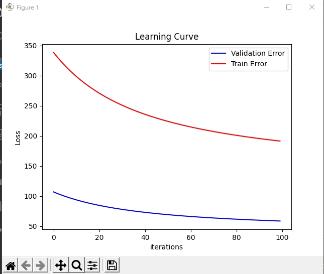
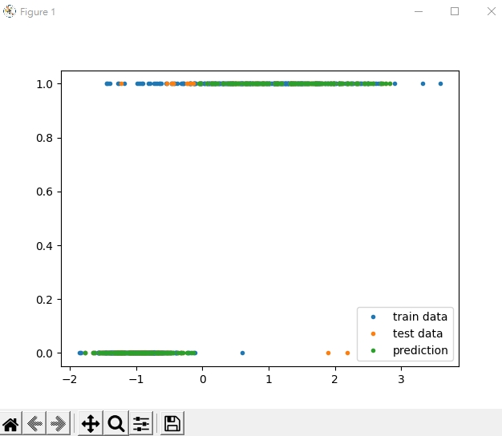
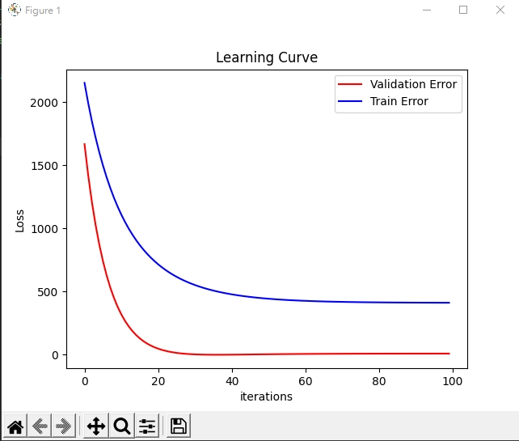

# ML_intro

## HW1: Logistic regression and Linear Regression using Gradient Descent

* Linear Regression and Logistic Regression using numpy

* Enter command in terminal
```bash
python3 LinearRegression.py
python3 LogisticRegression.py
```
* Output

* LinearRegression
MSE is xxx
Intercept is [*w*~0~] and weights are [*w*~1~, *w*~2~, ...]
* LogisticRegression
Cross Entropy Error is xxx
Intercept is [*w*~0~] and weights are `[*w*~1~, *w*~2~, ...]


| Method            | Learning Curve | Result |
| ----------------- | -------- | -------- |
| Logistic Regression |  |          |
| Linear Regression |      |      |

